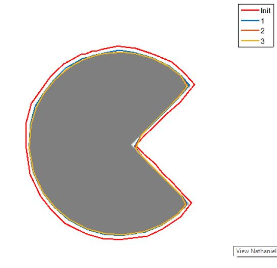

See Derivation.pdf for more details.

*Smoothening:* In order to have a gradient field which is non-zero away from the object boundaries, I used Gaussian smoothing of image. This helps in cases when image contains noise or when the initial snake is not close to the object boundaries.

**Results**
Below is the plot of application of this snake on Pacman image. The 3 stages of snake are shown with different colors.

Snake with alpha=0.5, beta=1.0, delta=5000

Despite the smoothing, the snake only works if I initialize the curve close to the object boundaries, otherwise the external energy component becomes zero and is unable to pull the curve towards boundary. Also the final curve is unable to reach the sharp corners in the Pacman image. This shortcoming can be overcome by adjusting the weight factors based on experimentations. Below is plot of running on same image with different weight parameters.

Snake with alpha=0.1, beta=0.01, delta=5000

