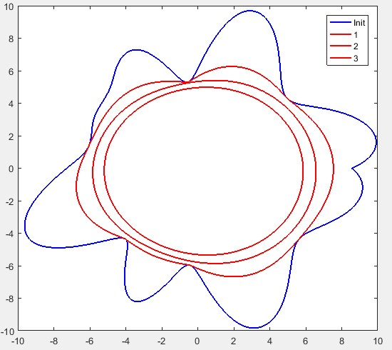
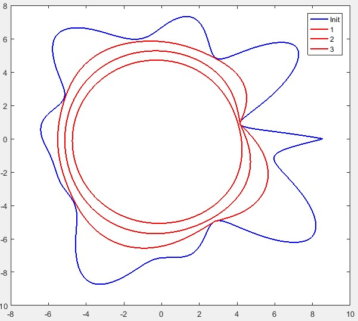
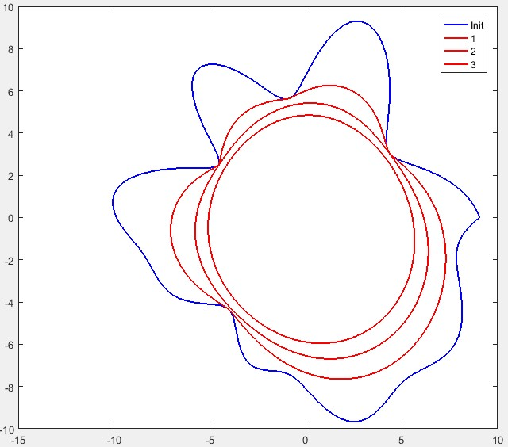

The curvature flow equation is given by `?C/?t= KN` where `K` is the curvature and `N` is the normal at any point on the curve.
For the computation of curvature, I have used,

`K=  (dx d^2 y-dy d^2 x)/(dx^2+dy^2 )^(3/2)`

And the Normal to the surface is computed by, `N=[-dy/ds, dx/ds]` where, `ds= v(dx^2+dy^2)`
The coordinates are updated in the following way,

`x ?x-?t(K N)`

`y ?y-?t(K N)`

**Curve generation:** The curve is generated by calling the inbuilt function interp1() to produce a cubic-spline from a randomly generated coarse points. Please refer code as the comments are self-explanatory.

**Results** Below is the curve development plot (starting from a random state) with three-different stages of development color coded as shown in the plot-legends:

Another one:

One more:
